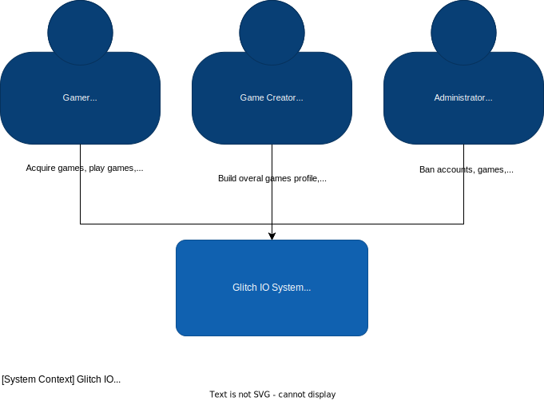
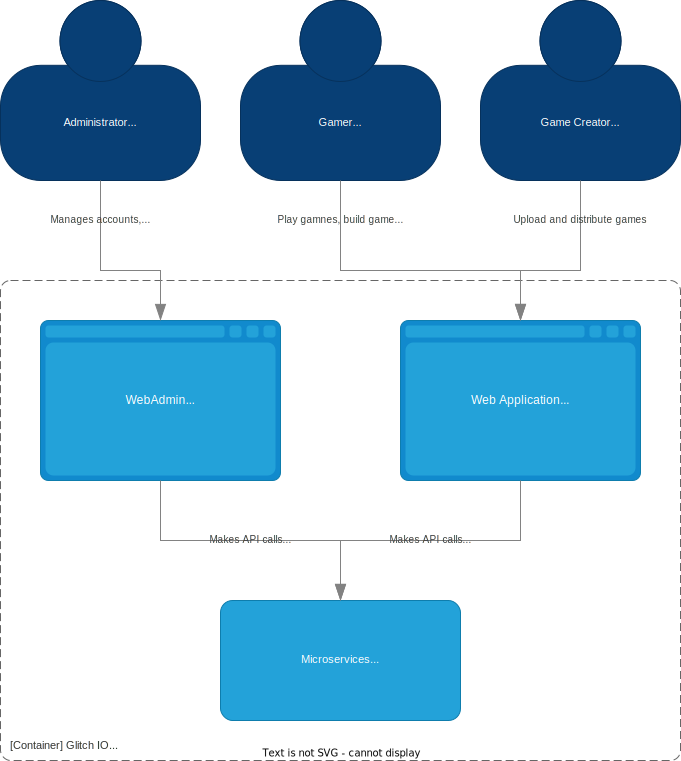
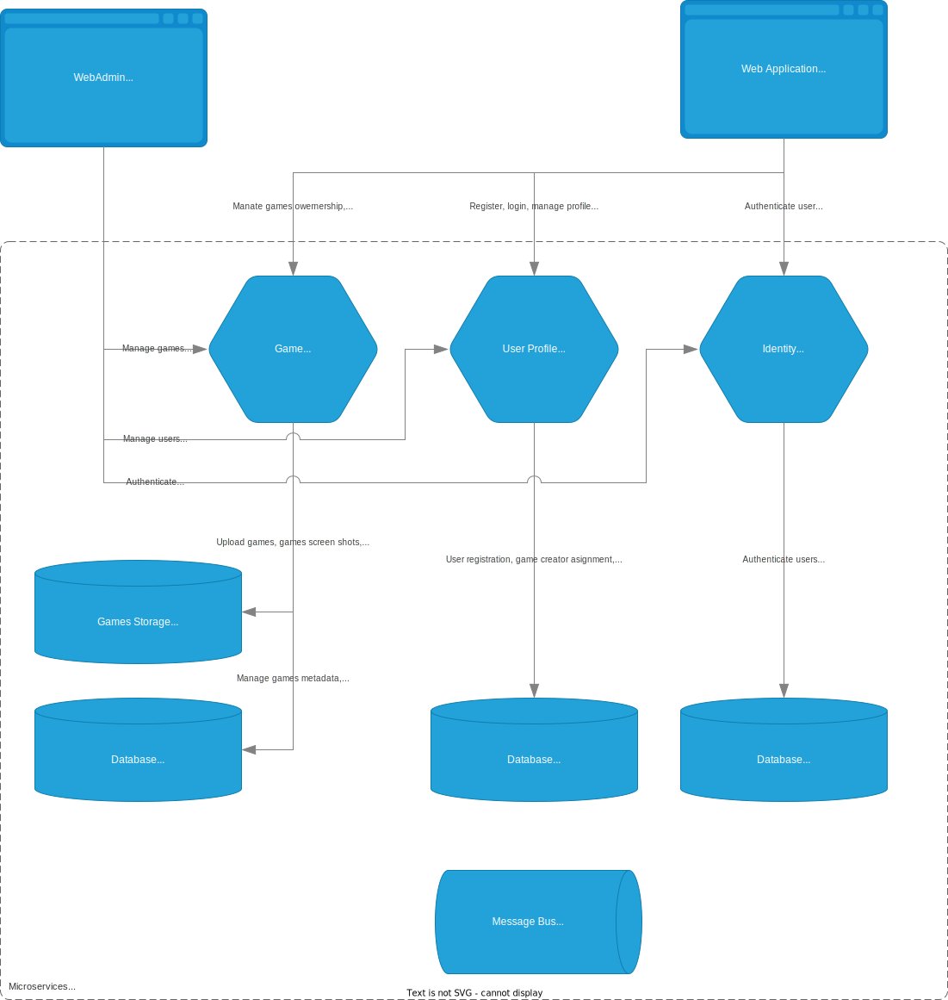

# Glitch IO

Inspired by [itch.io](https://itch.io/) - primitive social network app to share you games, play other people's games etc. The idea is to consolidate microservice and azure knowledge and to have poligon for the new technologies.

# Getting Started

# Tech Stack
* .net 7
* azure sql 
* azure storaga account (file storage; table storage)

# Architecture
## Context System diagram
Highlevel overview of the system and its users.

## Container Glitch IO diagram
Zoom in of the **Glicth IO System** from the System Context diagram

## Container Microservices diagram
Zoom in of the **Microservices** container from Container Glitch IO diagram

# License
Open source software, licensed under the terms of MIT license. See [LICENSE](LICENSE) for details.